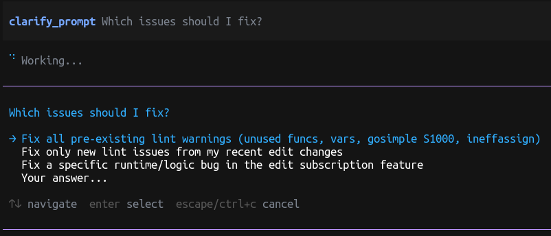

# pi-clarify

Prompt clarification extension for [pi coding agent](https://github.com/mariozechner/pi-coding-agent).



## Features

- **`clarify_prompt` tool** - Prompts the LLM to ask clarifying questions when user input is vague
- **Vague input detection** - Automatically detects ambiguous referents, unclear outcomes, undefined scope, and missing constraints
- **`/clarify` toggle** - Enable or disable clarification with `/clarify on|off`
- **`!` bypass prefix** - Prefix prompts with `!` to skip clarification for one turn

## Installation

```bash
pi install npm:@dkmnx/pi-clarify
```

Or add directly to your `settings.json`:

```json
{
  "packages": ["npm:@dkmnx/pi-clarify"]
}
```

## Usage

### Automatic Clarification

When enabled, the LLM automatically detects vague prompts and asks for clarification:

- "fix it" → "What specifically needs to be fixed?"
- "make it better" → "What does 'better' mean in this context?"
- "optimize this" → "Which files or functions should be optimized?"

### Manual Tool Call

The LLM can explicitly call the `clarify_prompt` tool:

```typescript
clarify_prompt({
  question: "What specific behavior needs to be fixed?",
  options: [
    "Fix the login redirect issue",
    "Fix the form validation error",
    "Fix the memory leak in the dashboard"
  ]
})
```

### Commands

| Command        | Description                 |
| -------------- | --------------------------- |
| `/clarify`     | Toggle clarification on/off |
| `/clarify on`  | Enable clarification        |
| `/clarify off` | Disable clarification       |

### Bypass

Prefix your prompt with `!` to skip clarification for one turn:

```text
! fix it - just update the error message text
```

## Trigger Patterns

The extension detects these vague input patterns:

- **Ambiguous referents**: "fix it", "this is broken", "the bug"
- **Unclear outcomes**: "make it better", "improve the code"
- **Undefined scope**: "refactor everything", "fix the tests"
- **Missing constraints**: "just fix it", "quickly update"
- **Very short requests**: Under 20 characters

## License

[MIT](LICENSE)
