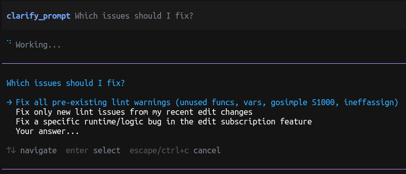

# pi-clarify

Prompt clarification extension for [pi coding agent](https://github.com/earendil-works/pi-mono).



## Features

- **`clarify_prompt` tool** - Prompts the LLM to ask clarifying questions when user input is vague
- **Vague input detection** - Flags structurally empty input (blank, single-character, or pure punctuation) and lets the LLM judge ambiguity for everything else via an injected system-prompt guideline
- **`/clarify` toggle** - Enable or disable clarification with `/clarify on|off`
- **`~` bypass prefix** - Prefix prompts with `~` to skip clarification for one turn

## Installation

```bash
pi install npm:@dkmnx/pi-clarify
```

Or add directly to your `settings.json`:

```json
{
  "packages": ["npm:@dkmnx/pi-clarify"]
}
```

## Usage

### Automatic Clarification

When enabled, the LLM automatically detects vague prompts and asks for clarification:

- "fix it" → "What specifically needs to be fixed?"
- "make it better" → "What does 'better' mean in this context?"
- "optimize this" → "Which files or functions should be optimized?"

### Manual Tool Call

The LLM can explicitly call the `clarify_prompt` tool:

```typescript
clarify_prompt({
  question: "What specific behavior needs to be fixed?",
  options: [
    "Fix the login redirect issue",
    "Fix the form validation error",
    "Fix the memory leak in the dashboard"
  ]
})
```

### Commands

| Command        | Description                 |
| -------------- | --------------------------- |
| `/clarify`     | Toggle clarification on/off |
| `/clarify on`  | Enable clarification        |
| `/clarify off` | Disable clarification       |

### Bypass

Prefix your prompt with `~` to skip clarification for one turn:

```text
~ fix it - just update the error message text
```

> `~` is used instead of `!` because pi reserves `!`/`!!` as the built-in shell-command prefix.

## How vague input is detected

Clarification is driven by the LLM, not by keyword matching. When enabled, the extension appends a `CLARIFY_PROMPT` guideline to the system prompt instructing the model to call `clarify_prompt` whenever a request is ambiguous, has unclear outcomes/scope, admits multiple valid interpretations, or is missing constraints.

The only client-side heuristic is a minimal structural guard: completely blank, single-character, or pure-punctuation input is flagged as vague so the model receives an extra reminder. Short but actionable commands like `git push` or `npm test` are **not** auto-flagged — the model decides based on the full conversation context.

### Example patterns the LLM is told to clarify

These are examples the injected guideline tells the model to watch for (the model does the actual judgment, not the extension):

- **Ambiguous referents**: "fix it", "this is broken", "the bug"
- **Unclear outcomes**: "make it better", "improve the code"
- **Undefined scope**: "refactor everything", "fix the tests"
- **Missing constraints**: no mention of backwards compatibility, performance priorities, or approach preferences
- **Multiple valid interpretations**: the request could reasonably mean 2+ different things

## License

[MIT](LICENSE)
